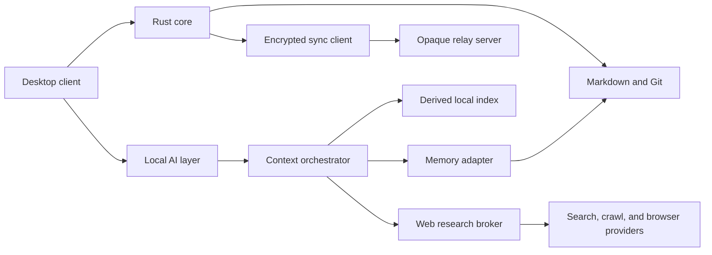

# Haven Clean Rebuild Design

**Date:** 2026-07-10 **Status:** Approved in design review; awaiting written-spec review

## Summary

Haven will restart from a clean production codebase while preserving the existing repository
history. The previous implementation remains available as evidence, but no code carries forward
automatically.

The rebuild changes Haven from an offline-first application into a local-model-first, networked
collaboration product. Markdown and Git remain canonical. AI inference defaults to local models,
while encrypted sync, collaboration, and tool-mediated web research are first-class internet
features.

The first executable milestone is decision-only. It produces the experiments, ADRs, threat model,
and acceptance criteria needed to begin production development without inventing architecture during
implementation.

## Why a Clean Rebuild Is Necessary

The current plan is directionally strong but mixes product strategy, architecture, implementation
tasks, future ideas, and status in a single large document. The current implementation was also
completed against an older plan before several governing decisions were made. Examples include the
editor selection, safe existing-vault behavior, Git write policy, collaboration trust model, memory
model, and web-research security boundary.

The existing branch is therefore treated as a prototype. Its tests and code can inform experiments,
but a component is not retained merely because it already exists.

## Product Promise

Haven is a Git-native, agent-native knowledge environment for people who want:

- Local ownership of Markdown knowledge and Git history.
- A simple OKF knowledge model instead of proprietary block, tag, or database syntax.
- Local-model inference without silent remote-model calls.
- End-to-end encrypted multi-device sync and collaboration over the internet.
- Durable, reviewable agent memory with source provenance.
- Local-model research that combines vault context, memory, and fresh web evidence.
- Human control over every durable agent-authored change.

## Revised Product Invariants

1. Markdown and Git are the canonical knowledge record.
2. Haven-created knowledge follows Google's Open Knowledge Format (OKF) v0.1: YAML frontmatter for
   structured metadata, a standard Markdown body, standard Markdown links, and reserved
   `index.md`/`log.md` conventions.
3. Haven does not invent inline supertags, block-level schemas, proprietary relationship syntax, or
   another object database. Structured views derive from YAML frontmatter and links.
4. Local models are the default; remote models require explicit configuration.
5. Internet sync, collaboration, and web research are first-class product capabilities.
6. The sync relay cannot decrypt user content, filenames, memories, comments, or attachments.
7. Every durable human, agent, import, memory, and collaboration change retains provenance.
8. Indexes, caches, external memory engines, and research caches are derived and rebuildable.
9. Models receive network and write authority only through typed, policy-controlled tools.
10. Losing connectivity does not block reading or editing an already-open local vault; operations
    queue and reconcile when connectivity returns.
11. The desktop app exposes no inbound network service. It makes outbound connections to explicitly
    configured sync, search, crawling, memory, and model providers.

These invariants supersede the existing requirement that every free-tier feature work with the
network disconnected. The restart foundation must update `AGENTS.md`, `PLAN.md`, and the governing
ADRs together so that repository guidance is internally consistent.

## Static Knowledge Model

Haven adopts the official [Open Knowledge Format v0.1][okf-spec] as its on-disk knowledge contract.
The format is intentionally small: every non-reserved concept is a UTF-8 Markdown file with
parseable YAML frontmatter and a non-empty `type`; recommended fields are `title`, `description`,
`resource`, `tags`, and `timestamp`; unknown keys remain valid and must survive round trips.

Haven uses that flexibility without layering a proprietary schema over it:

- YAML frontmatter is the only structured property surface.
- Standard Markdown links express relationships; surrounding prose provides their meaning.
- `index.md` supports progressive disclosure and `log.md` records scoped update history.
- Bodies remain freeform Markdown. The local AI interprets structure and prose without requiring
  users to tag individual blocks.
- Saved tables, lists, filters, backlinks, and graph views are derived projections, not new storage
  syntax.
- Haven writes standard Markdown links in new OKF documents while losslessly preserving wikilinks
  and unknown syntax in existing vaults until the user explicitly migrates them.
- Reading remains permissive. Haven must tolerate unknown types, unknown keys, broken links, and
  missing optional fields.

Tana-style supertags, Logseq-style block identity as a universal data model, Notion-style databases,
and proprietary inline semantics are launch non-goals.

## Restart Boundary

- Preserve commit `691e8d0` and the current implementation branch as the pre-rebuild reference.
- Start production rebuilding on `cursor/rebuild-foundation-d85e`.
- Remove the obsolete implementation, manifests, generated lockfiles, and scaffold from the rebuild
  branch.
- Preserve repository history, licensing, approved product knowledge, and `AGENTS.md` after revising
  its superseded invariant.
- Inventory the dirty worktree before reset. Do not delete, commit, or absorb unrelated user
  changes.
- Existing implementation may be inspected during experiments but cannot be copied forward without
  passing the newly approved acceptance tests and dependency review.
- Keep disposable experiments under `experiments/` and prevent them from being imported by
  production code.

## Documentation Structure

`PLAN.md` becomes a concise execution contract containing:

- Product promise and primary user.
- Product invariants.
- Active milestone map.
- Evidence-linked milestone status.
- Launch non-goals.
- Later horizons without implementation task breakdowns.

Detailed artifacts live in:

- `docs/superpowers/specs/` for approved product and system designs.
- `docs/superpowers/plans/` for executable, test-driven implementation plans.
- `docs/adr/` for durable technical decisions and their evidence.
- `docs/research/` for prior-art reviews, experiments, benchmarks, and user research.

A milestone has one of four states: `not started`, `discovery`, `implementation`, or `verified`.
`verified` requires links to acceptance evidence. Commits, code volume, and partially passing tests
do not count as completion evidence.

## Milestone Sequence

### R0 - Restart foundation and architecture bakeoffs

Approve the launch workflows, editor decision, Git policy, E2EE collaboration architecture,
local-model runtime, web-research boundary, memory model, hardware matrix, threat model, and
prior-art decisions. Production feature code is prohibited. Disposable experiments are allowed.

### M1 - Safe vault open

Open Obsidian, Logseq, and plain Markdown/Git folders read-only. Produce a compatibility report and
prove that Haven performs zero user-file writes before explicit write enablement.

### M2 - Trustworthy human writes

Create and edit notes through a lossless Markdown surface. Add path confinement, atomic writes,
OKF-conformant output, isolated Git staging, human provenance, recovery snapshots, visible diffs,
and a conflict inbox.

### M3 - Internet sync foundation

Synchronize signed, encrypted change envelopes and attachments between a user's devices through an
untrusted relay. Add device identity, invitations, acknowledgements, recovery, key rotation, and
revocation.

### M4 - Shared spaces and asynchronous collaboration

Add E2EE shared spaces, roles, suggestions, comments, activity history, review, and
provenance-preserving merge workflows. Server operators cannot decrypt shared content.

### M5 - Disposable retrieval

Add incremental indexing, keyword search, backlinks, watcher reconciliation, and rebuild-from-files
verification. Deleting `.haven/` must lose no canonical information.

### M6 - Cited local intelligence and web research

Add hardware-aware local-model setup, evaluated hybrid retrieval, typed internet-research tools,
separate vault and web citations, read-only MCP, and agent-proposed patches requiring explicit human
approval.

### M7 - Durable agent memory

Add the memory inbox, file-native canonical observations, personal and shared memory scopes,
contradiction handling, forgetting, external memory-engine adapters, and evidence-linked reflection
proposals.

### M8 - Founder workflow proof and beta gate

Run the founder dogfood and external activation tests across local editing, asynchronous
collaboration, cited research, Knowledge Diffs, and durable memory. Public beta requires the numeric
safety, collaboration, and activation gates to pass.

Live cursors, simultaneous editing, CRDT session overlays, teams, marketplace distribution, broad
importer coverage, autonomous skill execution, and unrelated PKM parity remain later horizons until
evidence promotes them.

## System Boundaries



### Desktop client

Owns the editor, review UI, conflict inbox, citations, permissions, trust indicators, and
collaboration surfaces. It never performs direct filesystem or secret access.

### Rust core

Owns confined filesystem access, Git provenance, atomic writes, indexing, encryption, sync
reconciliation, and recovery. Long-running work runs outside latency-sensitive UI paths.

### Local AI layer

Owns the model provider, context orchestration, typed tool calls, structured output, and token
budgets. Local models do not receive raw network, filesystem, keychain, or sync authority.

### Memory adapter

Owns file-native retrieval and replaceable external engines. External stores are derived from
approved memory files and must be completely rebuildable.

### Web research broker

Owns search, fetch, crawl, extraction, browser isolation, URL policy, and research budgets. It
normalizes provider output into a common evidence format.

### Sync client

Owns encrypted envelopes, device identity, space keys, key rotation, acknowledgements, replay
protection, and conflict detection.

### Relay server

Owns opaque object storage, delivery, membership coordination, delivery receipts, and rate limiting.
It cannot grant itself content access or recover user encryption keys.

## E2EE Sync and Collaboration

### Change flow

1. Validate an edit, atomically write Markdown, and create the correct Git commit.
2. Convert the commit and required objects into a signed, content-addressed change envelope.
3. Encrypt the envelope and attachments with the shared-space content key.
4. Upload only ciphertext and minimal routing metadata.
5. Download envelopes on authorized devices, then decrypt and verify them locally.
6. Reconcile verified changes into the local working tree.
7. Create provenance-preserving commits for clean changes.
8. Put ambiguous changes in the conflict inbox with every version preserved.

The first collaboration release includes multi-device sync, invitations, roles, suggestions,
comments, activity history, and asynchronous review. Live cursors and simultaneous editing are
outside the active roadmap. Haven must first prove that asynchronous Git provenance, review, and the
conflict inbox are sufficient for its target workflows.

### Key model

- Each device has an identity key stored in the OS keychain.
- Each shared space has a content-encryption key.
- Invitations grant the space key to an authorized device identity.
- Revocation rotates future keys so revoked devices cannot decrypt new content.
- A user-controlled recovery key permits recovery without creating a server backdoor.
- Failed rotation blocks new sharing rather than falling back to plaintext.

### Prior-art bakeoff

R0 compares:

- any-sync for E2EE spaces, permissions, history, and self-hosting.
- Syncthing for mature file synchronization and untrusted-device encryption.
- Automerge and Loro as conflict and convergence references, not planned live-editing dependencies.
- A minimal encrypted Git-envelope relay for direct compatibility with Haven's canonical data model.
- Seafile as an interoperability option rather than a presumed native foundation.
- git-remote-gcrypt as protocol prior art, not a default dependency.

The bakeoff records license compatibility, metadata leakage, key handling, conflict semantics,
mobile fit, deployment complexity, recovery, performance, and whether a candidate creates a second
source of truth. Haven builds a native relay only when this evidence shows that adoption or
adaptation cannot satisfy the approved invariants.

## Local Model and Web Research

The local model accesses the internet only through typed research tools:

- `web_search(query)`
- `fetch_page(url)`
- `crawl_site(url, limits)`
- `extract_structured(url, schema)`
- `interact_with_page(task)`

### Research flow

1. Retrieve relevant vault documents and approved memories.
2. Decide whether fresh information is required.
3. Search the web within the active research session.
4. Fetch and extract selected sources within visible budgets.
5. Treat fetched content as untrusted evidence rather than instructions.
6. Compare extracted claims with high-recall vault and approved-memory retrieval.
7. Produce an answer with distinct vault, memory, and web citations.
8. Produce a Knowledge Diff separating novel, corroborating, conflicting, and uncertain claims.
9. Optionally save a provenance-linked research document through the normal review and Git pipeline.

Web research is session-scoped by default. Once enabled for a request, the model may search and
fetch within visible domain, request, time, depth, and content-size budgets without asking before
every page.

### Static research-tool routing

Research tools are registered statically at build time. The context orchestrator does not discover
or inject dynamic tool definitions during a request.

A small, fast local selector model receives the user's intent plus compact context metadata and
emits a schema-validated `ResearchIntent` enum: `search`, `fetch`, `crawl`, `extract`, `interact`,
or `no_web`. A deterministic policy router validates the selection, applies permissions and budgets,
and invokes the corresponding static wrapper. The selector cannot call tools directly.

The larger reasoning model receives only normalized evidence, provenance, and retrieval diagnostics.
It does not need every provider schema in its prompt. Low-confidence or invalid selector output
falls back to bounded search or `no_web` according to deterministic policy rather than loading tools
dynamically.

### Generative Citation Intelligence

After web extraction, Haven creates a Knowledge Diff against the local vault and approved memories:

- **Novel:** no materially equivalent claim was found in the retrieved local corpus.
- **Corroborating:** the web evidence independently supports an existing local claim.
- **Conflicting:** the web evidence disagrees with or supersedes a local claim.
- **Uncertain:** retrieval coverage or evidence quality is insufficient for classification.

"Novel" means not found by the recorded retrieval run; it is not proof that the information is
absent from the entire vault. The UI shows the query, retrieval coverage, compared local passages,
web sources, and classification confidence.

Saving a Knowledge Diff creates a reviewable OKF document such as `type: research-diff` with source
URLs, access timestamps, compared local concept links, and claim-level citations. The agent proposes
updates to affected concepts as separate Git diffs; it never silently merges crawled claims into the
vault.

### Provider policy

The `WebResearchProvider` boundary supports hosted and self-hosted providers. R0 evaluates:

- SearXNG for self-hosted search.
- Firecrawl for search, scraping, crawling, extraction, and interactive pages.
- Crawl4AI as an Apache-licensed self-hosted crawler and extraction alternative.
- Playwright for sandboxed interactive-browser tasks that extraction cannot complete.
- A lightweight local extractor for simple static pages so every fetch does not require a crawler
  service.

The provider decision accounts for license, reliability, JavaScript support, robots behavior,
structured output, resource cost, authentication, observability, and hosted-versus-self-hosted
feature differences.

### Network and content safety

- Block private, loopback, link-local, and cloud-metadata targets.
- Re-resolve and revalidate every redirect to prevent DNS rebinding and redirect-based SSRF.
- Enforce allowed MIME types and request, byte, time, redirect, and crawl-depth limits.
- Respect `robots.txt` by default and expose any user-approved override clearly.
- Run interactive browsers without vault, keychain, sync, or unrestricted filesystem access.
- Do not provide authenticated browsing by default.
- Never treat page text as tool instructions or permission grants.
- Prevent fetched content from invoking write, key, sync, memory-approval, or collaboration tools.

## Unified Context and Durable Memory

Every generation passes through a `ContextOrchestrator` with a fixed token budget and source
provenance. Context priority is:

1. Current user request and selected document.
2. Relevant vault passages.
3. Approved personal or shared memories.
4. Recent collaboration activity.
5. Fresh web evidence.
6. Older conversation history.

The orchestrator deduplicates overlapping evidence, records retrieval reasons, preserves source
links, and prevents web content from displacing the user's request or Haven's instructions.

### Canonical memory

Memories use provenance-linked Markdown documents. A representative schema is:

```yaml
---
type: memory-observation
subject: preferred-editor
scope: personal
timestamp: 2026-07-10T12:00:00Z
confidence: 0.92
sources:
  - conversations/2026-07-10.md
supersedes: []
sensitivity: private
status: approved
---
The user prefers a raw Markdown escape hatch in rich editors.
```

The default capture policy is a memory inbox. The model proposes useful memories, but the user
approves, edits, rejects, forgets, or changes their scope before they become canonical.

- Personal memories remain in the user's private local space.
- Shared memories require explicit attachment to an E2EE shared space.
- Contradictions create superseding observations rather than overwriting history.
- Forgetting removes the observation from derived indexes and external engines.
- Reflections and mental models return as reviewable proposals.
- External-engine failure falls back to file-native retrieval.

### Memory-engine bakeoff

R0 compares a file-native baseline, Hindsight, Mem0, and Graphiti-derived behavior. Hindsight is the
primary self-hosted adapter candidate, but its service database cannot become canonical. Mem0 is an
alternative adapter. Graphiti is primarily a reference for temporal validity, contradiction
handling, and provenance.

The bakeoff measures recall accuracy, temporal reasoning, contradiction handling, evidence
attribution, deletion, rebuildability, local-model compatibility, latency, peak RAM, deployment
complexity, and private versus shared isolation. Redis Iris is excluded from the core because it is
a managed cloud service; it may only become an explicit optional provider.

## Failure Handling

- Network loss queues encrypted sync operations while local editing continues.
- Revoked devices cannot decrypt content encrypted after rotation.
- Divergent changes preserve every version and enter the conflict inbox.
- Failed key rotation blocks new sharing rather than weakening encryption.
- Relay failure leaves the local canonical repository intact.
- Memory-engine failure falls back to file-native retrieval.
- Web-provider failure falls back to local evidence and reports that freshness could not be checked.
- Suspicious web instructions are quarantined and cannot trigger privileged tools.
- Interrupted writes and merges retain deterministic recovery data.
- Corrupt or unauthenticated envelopes are rejected without modifying the working tree.

## Verification Strategy

### Unit and property tests

- Path confinement, symlink handling, serialization, envelope parsing, and key rotation.
- Git staging isolation, author provenance, recovery, and deterministic conflict behavior.
- Context token budgets, deduplication, source attribution, and memory-scope isolation.
- Static selector schema validation, routing fallback, and the absence of dynamic tool registration.
- URL validation, redirect handling, MIME limits, SSRF defenses, and normalized provider output.

### Golden fixtures

- Lossless Markdown round trips for frontmatter, wikilinks, tables, embedded HTML, comments, and
  unknown syntax.
- Provider-normalized output for static, dynamic, malformed, oversized, and hostile web pages.
- Knowledge Diff classification for novel, corroborating, conflicting, and uncertain evidence.
- Memory contradiction, supersession, deletion, and reflection proposals.

### Integration tests

- Two-device and three-device E2EE sync through an untrusted relay.
- Invitations, revocation, replay, rollback, conflict, and interrupted catch-up.
- Hosted and self-hosted web and memory provider adapters using recorded fixtures by default.
- Deterministic fake-model tests for selector routing, research stopping, Knowledge Diffs,
  citations, and memory proposals.

### End-to-end and security tests

- Each launch workflow receives a permanent end-to-end acceptance test.
- Test malicious collaborators, poisoned notes, hostile pages, SSRF, prompt injection, oversized
  inputs, secret-exfiltration attempts, and compromised relay responses.
- Delete derived index, memory, and research-cache state, then rebuild from canonical files.

### Performance tests

- A 10,000-note vault for open, index, search, and rebuild behavior.
- Large attachments and long sync catch-up histories.
- Local-model first-token latency and bounded context assembly.
- Web-research request, byte, and wall-clock budgets.
- Memory recall latency and peak working set on supported hardware tiers.

## R0 Deliverables

R0 produces:

- The concise rewritten `PLAN.md`.
- Updated repository invariants in `AGENTS.md`.
- Three validated launch workflow specifications.
- The editor round-trip benchmark and ADR.
- The OKF v0.1 adoption, compatibility, and migration ADR.
- The Git write, provenance, recovery, and conflict-policy ADR.
- The E2EE sync and collaboration bakeoff and ADR.
- The local-model, context-orchestration, and web-research bakeoff and ADR.
- The static research selector and Knowledge Diff evaluation fixtures.
- The memory-engine bakeoff and ADR.
- The hardware and model support matrix.
- The unified threat model.
- The prior-art and license register.

R0 is complete only when:

- Every governing decision has evidence and no unresolved placeholder.
- The old implementation is preserved in history but absent from the rebuild branch.
- Disposable experiment code is isolated from production paths.
- The launch workflows include user-visible trust states and measurable acceptance criteria.
- Hosted and self-hosted expectations are documented for every external service.
- The M1 safe-vault implementation can be planned without making architecture decisions during
  coding.

After R0, the next implementation plan covers only M1. Later milestones receive their own design and
plan when their prerequisites are verified.

[okf-spec]: https://github.com/GoogleCloudPlatform/knowledge-catalog/blob/main/okf/SPEC.md
